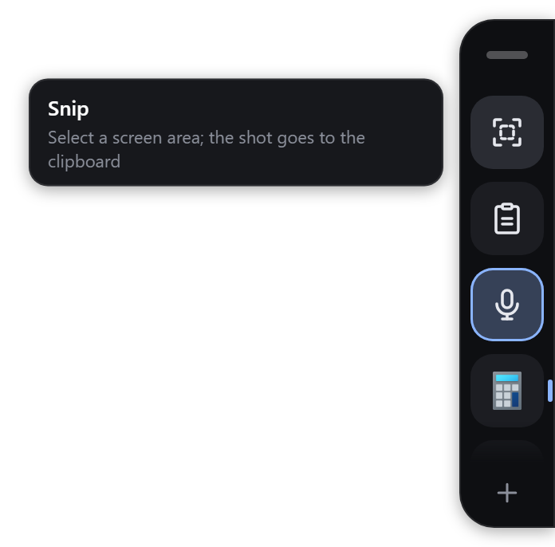
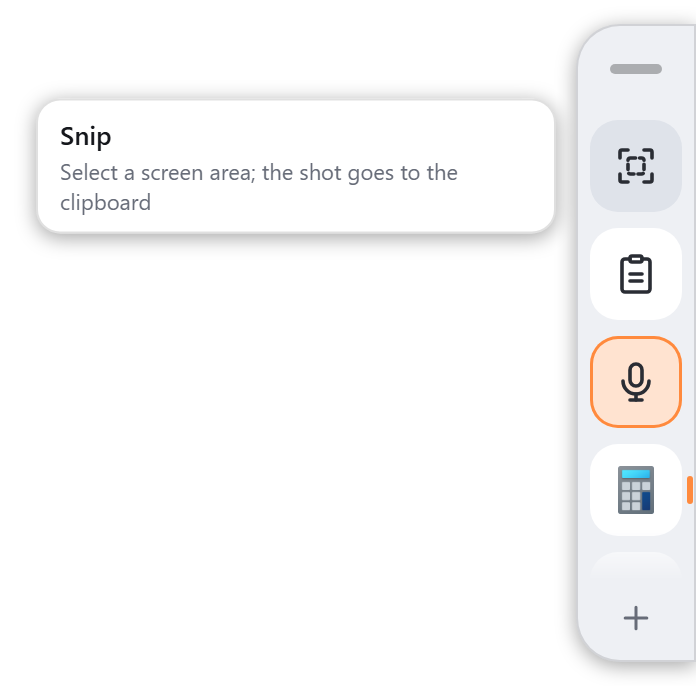
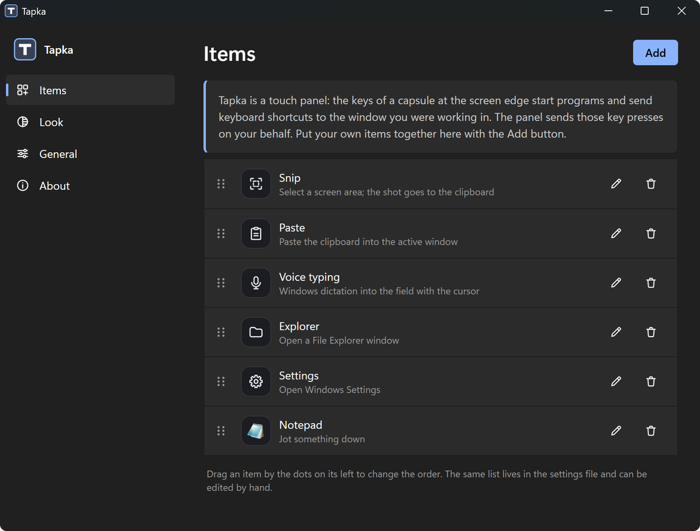

<p align="center"><a href="README.md">EN</a> · <b>RU</b></p>

<p align="center"></p>

<h1 align="center">Tapka</h1>

<p align="center">
  <a href="https://github.com/Sargares22/tapka/releases/latest"></a>
  
  <a href="LICENSE"></a>
</p>

<p align="center">
  <a href="#установка">Установка</a> · <a href="#что-она-умеет">Что она умеет</a> · <a href="#свои-клавиши">Свои клавиши</a> · <a href="#рецепты">Рецепты</a> · <a href="#приватность">Приватность</a> · <a href="CHANGELOG.md">Что нового</a>
</p>

Tapka — сенсорная панель для Windows 11: узкая капсула у края экрана с крупными клавишами. Клавиша запускает программу, открывает сайт, файл или папку либо отправляет сочетание клавиш в окно, где вы работали. Сделана для планшетов и трансформеров: когда клавиатура отстёгнута, вместе с ней пропадают снимок экрана, вставка и диктовка. Работает пальцем, пером и мышью.

<p align="center">
  
  
</p>

<p align="center"><a href="https://github.com/Sargares22/tapka/releases/download/v1.0.0/tapka-intro.mp4">▶ Ролик на 50 секунд (на английском)</a></p>

## Установка

1. Откройте [Releases](https://github.com/Sargares22/tapka/releases/latest) и скачайте установщик под свой процессор: `Tapka_…_arm64-setup.exe` для устройств на ARM (Snapdragon), `Tapka_…_x64-setup.exe` для Intel и AMD.
2. Запустите его. Установщик не подписан, поэтому Windows покажет окно «Система Windows защитила ваш компьютер»: нажмите **Подробнее**, затем **Выполнить в любом случае**.
3. Tapka ставится для текущего пользователя, без прав администратора, и сразу запускается.

При первом запуске у правого края появится капсула с действиями Windows, которые работают сразу, и один раз откроется окно настроек. Удалить Tapka можно в «Параметрах» Windows, в разделе «Установленные приложения».

Некоторые антивирусы настороженно относятся ко всему, что отправляет нажатия клавиш, а Tapka делает именно это, когда вы касаетесь клавиши с сочетанием. Если ваш антивирус поднял тревогу, в разделе [Приватность](#приватность) написано, что панель делает и чего не делает; весь исходный код лежит здесь.

## Что она умеет

- **Не забирает фокус.** Вы касаетесь клавиши, сочетание уходит в окно, где вы работали, и это окно остаётся активным.
- **Снимок без капсулы в кадре.** Клавиша «Снимок» прячет капсулу на время выделения области и возвращает её, когда вы закончили.
- **Ведёт себя как панель задач.** У клавиши, чья программа запущена, видна метка; повторное касание выводит окно вперёд или сворачивает его. Tapka ничего не закрывает.
- **Четыре клавиши на виду, остальные прокруткой.** Список прокручивается пальцем; гаснущий край подсказывает, что дальше есть ещё. Маленький **+** внизу капсулы открывает редактор.
- **Встаёт туда, куда вы её перенесли.** Капсулу можно перенести за ручку к левому, правому или верхнему краю. После поворота экрана или смены разрешения она остаётся у своего края.
- **Без клавиатуры — просторнее.** Когда клавиатура отстёгнута, клавиши стоят дальше друг от друга, под палец.
- **Ваш вид.** Тёмная тема, светлая или как в Windows; любой цвет акцента; три размера.
- **Русский и английский.** По умолчанию язык Windows; меняется в настройках.
- **Тихие обновления.** Одна проверка за запуск, строка в настройках и кнопка «Обновить». Без всплывающих окон. Проверку можно выключить.

Готовые действия Windows: снимок области, вставить, копировать, отменить, голосовой ввод, представление задач, показать рабочий стол, Проводник, Параметры, экранная клавиатура.

## Свои клавиши

Коснитесь **+** внизу капсулы или откройте настройки из значка в трее.

<p align="center"></p>

**Добавить** предлагает четыре вида клавиш:

| Вид | Что нужно сделать |
|---|---|
| Программа | Выберите её из списка установленных. Название и значок берутся из самой программы. |
| Сайт, файл или папка | Впишите адрес либо выберите файл или папку. |
| Сочетание клавиш | Нажмите его на клавиатуре или соберите кнопками Ctrl, Shift, Alt и Win, если клавиатуры нет. |
| Действие Windows | Выберите одно из готовых действий. |

Порядок меняется перетаскиванием клавиши за точки; карандаш меняет название, подсказку и значок; корзина удаляет, удаление можно отменить.

### Файл настроек

Всё хранится в одном файле, `settings.json`, в папке `%APPDATA%\sargares22.tapka`; окно настроек открывает его само («Общие» → «Файл настроек»). Файл можно править руками, скриптом или через ИИ-агента: панель подхватывает правку в течение секунды, а окно настроек показывает тот же список.

```json
{
  "scale": 1.0,
  "top": 0.3,
  "edge": "right",
  "theme": "system",
  "accent": "#8ab4ff",
  "items": [
    { "name": "Снимок", "icon": "snip", "hint": "Выделить область экрана", "action": "hotkey", "keys": "win+shift+s" },
    { "name": "Заметки", "action": "open", "target": "C:\\Tools\\notes.exe" },
    { "name": "Почта", "icon": "chat", "action": "open", "target": "https://mail.example.com" }
  ]
}
```

- `action` — это `open` (с полем `target`: программа, файл, папка, адрес или адрес приложения вида `shell:AppsFolder\…`) либо `hotkey` (с полем `keys`, например `ctrl+shift+k`).
- `icon` — имя встроенного значка (`snip`, `paste`, `copy`, `undo`, `mic`, `tasks`, `desktop`, `folder`, `gear`, `keyboard`, `terminal`, `chat`, `browser`) либо файл PNG или SVG из папки `icons` рядом с файлом настроек. Без этого поля программа показывает свой значок, а всё остальное — первую букву названия.
- `top` — где капсула начинается вдоль своего края, от 0 до 1.
- Только в файле задаются две вещи: точное значение `top` и правило `lit`, о нём ниже.

Пункт с ошибкой пропускается, остальные работают; сломанный файл ничего не меняет, а подсказка значка в трее говорит, что не так.

## Рецепты

Tapka не привязана ни к одной сторонней программе. Ниже примеры того, что к ней подключают.

**Программа диктовки (Handy и подобные).** Добавьте клавишу вида «Сочетание клавиш» с сочетанием, которое слушает ваша программа диктовки, например `ctrl+space`. Чтобы клавиша светилась, пока идёт запись, допишите этому пункту в файле настроек правило `lit`: имя программы и заголовок окна, которое она показывает во время записи:

```json
{ "name": "Диктовка", "icon": "mic", "action": "hotkey", "keys": "ctrl+space",
  "lit": { "program": "handy.exe", "window": "Recording" } }
```

**ИИ-чаты.** Установленные приложения (ChatGPT, Claude, Copilot и другие): «Добавить» → «Программа» и выберите приложение. Чаты в браузере: «Добавить» → «Сайт, файл или папка» и вставьте адрес. Повторное касание клавиши приложения выводит его окно вперёд, как на панели задач.

**Папка, в которой вы работаете.** «Добавить» → «Сайт, файл или папка» → «Папка…».

**Сочетание другой программы.** Если у действия есть сочетание из Ctrl, Shift, Alt, Win и буквы, цифры, F1–F24 или клавиши навигации, оно может стать клавишей: выключить микрофон в звонке, сделать снимок сторонней программой. Знаки препинания, цифровой блок и медиаклавиши пока не поддерживаются. До программ, запущенных от имени администратора, сочетания не доходят: Windows не даёт обычной программе отправлять им нажатия.

## Приватность

Что панель делает:

- отправляет нажатия клавиш в активное окно, когда вы касаетесь клавиши с сочетанием;
- дважды в секунду читает список окон и их заголовки, чтобы отметить запущенные программы;
- если проверка обновлений включена, один раз за запуск обращается к GitHub.

Чего она не делает: не записывает, что вы печатаете, никуда не отправляет заголовки окон и не собирает статистику. Журнал лежит только на вашем компьютере и ограничен по размеру.

## Собрать самому

Вам понадобятся Rust с инструментами MSVC и Node.js (для консольной программы Tauri).

```
cargo test
node --test scripts/check-page.mjs
npx @tauri-apps/cli@2 build --target aarch64-pc-windows-msvc --no-bundle
```

Готовый exe лежит в `target/aarch64-pc-windows-msvc/release` (для Intel и AMD укажите `x86_64-pc-windows-msvc`). Установщики с подписанными файлами обновления делает `scripts/make-release.sh`, ему нужен ключ обновлений проекта, поэтому собственная сборка сама не обновляется.

Rust, Tauri 2 и WebView2; один бинарник, две страницы, один файл настроек.

## Лицензия

[WTFPL](LICENSE). Программа раздаётся как есть, без каких-либо гарантий: если что-то сломается, разбираться с этим вам. Встроенные значки нарисованы для этого проекта, см. [glyphs/NOTICE.md](glyphs/NOTICE.md).
